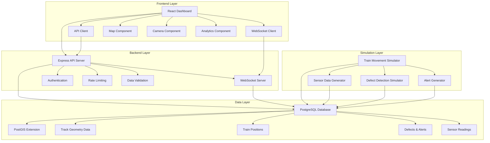
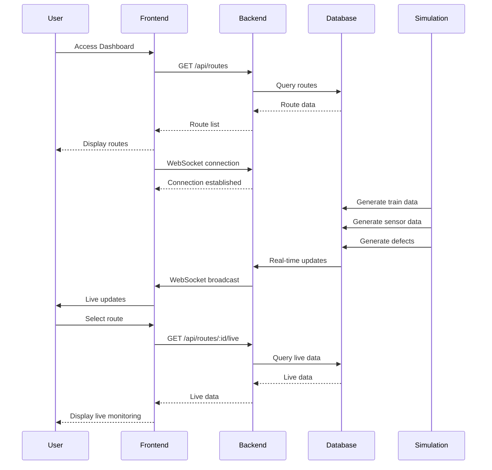
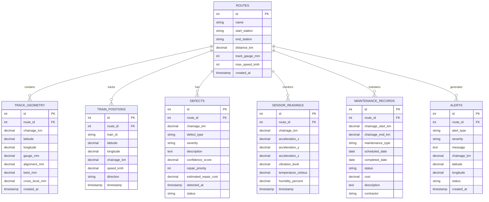
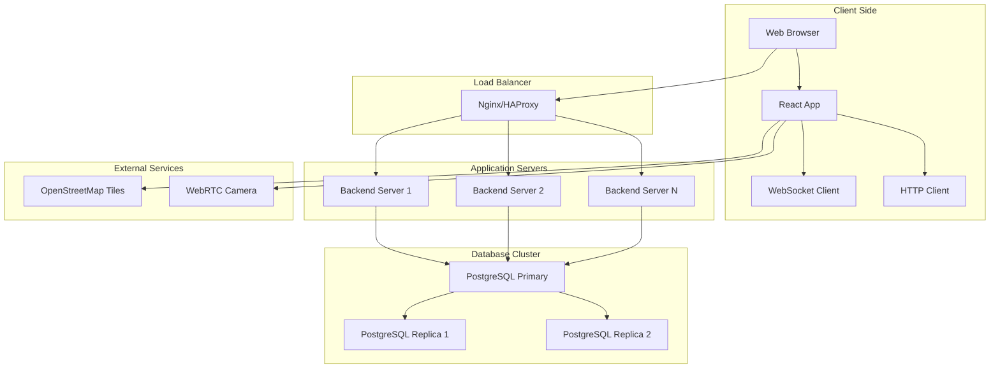
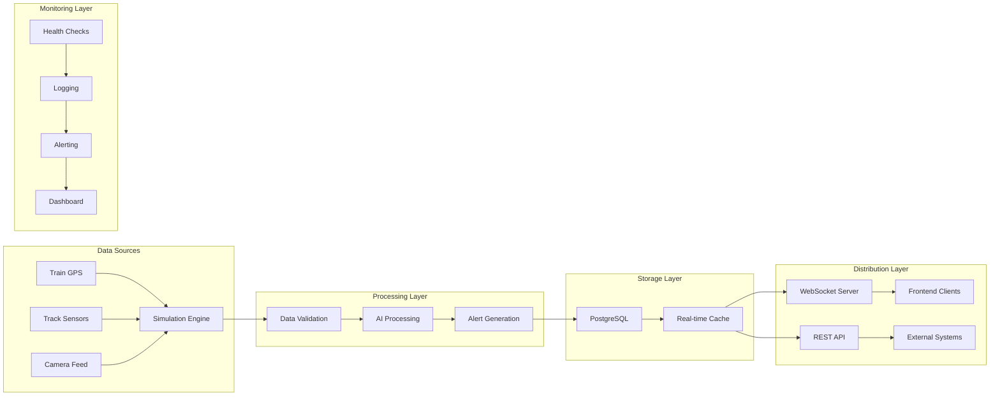
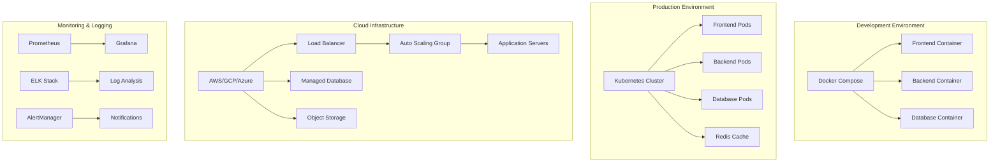
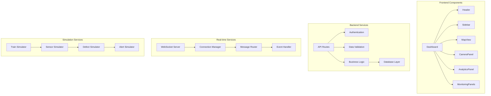

# 🏗️ ITMS System Architecture

## 📊 High-Level Architecture

## 🔄 Data Flow Architecture

## 🗄️ Database Schema Architecture

## 🌐 Network Architecture

## 🔄 Real-time Data Flow

## 🚀 Deployment Architecture

## 🔐 Security Architecture

```mermaid
graph TB
    subgraph "Security Layers"
        A[HTTPS/TLS] --> B[Authentication]
        B --> C[Authorization]
        C --> D[Input Validation]
        D --> E[Rate Limiting]
        E --> F[Data Encryption]
    end
    
    subgraph "Network Security"
        G[Firewall] --> H[VPN Access]
        H --> I[Network Segmentation]
        I --> J[Intrusion Detection]
    end
    
    subgraph "Application Security"
        K[CORS Policy] --> L[CSRF Protection]
        L --> M[XSS Prevention]
        M --> N[SQL Injection Prevention]
    end
    
    subgraph "Data Security"
        O[Database Encryption] --> P[Backup Encryption]
        P --> Q[Audit Logging]
        Q --> R[Data Retention]
    end
```

## 📊 Performance Architecture

```mermaid
graph TB
    subgraph "Caching Layer"
        A[Browser Cache] --> B[CDN Cache]
        B --> C[Application Cache]
        C --> D[Database Cache]
    end
    
    subgraph "Optimization Layer"
        E[Query Optimization] --> F[Index Optimization]
        F --> G[Connection Pooling]
        G --> H[Load Balancing]
    end
    
    subgraph "Monitoring Layer"
        I[Performance Metrics] --> J[Resource Monitoring]
        J --> K[Error Tracking]
        K --> L[User Analytics]
    end
    
    subgraph "Scaling Layer"
        M[Horizontal Scaling] --> N[Vertical Scaling]
        N --> O[Auto Scaling]
        O --> P[Load Distribution]
    end
```

## 🎯 Component Architecture

---

**This architecture ensures scalability, reliability, and maintainability of the ITMS system while meeting all performance and security requirements.**
